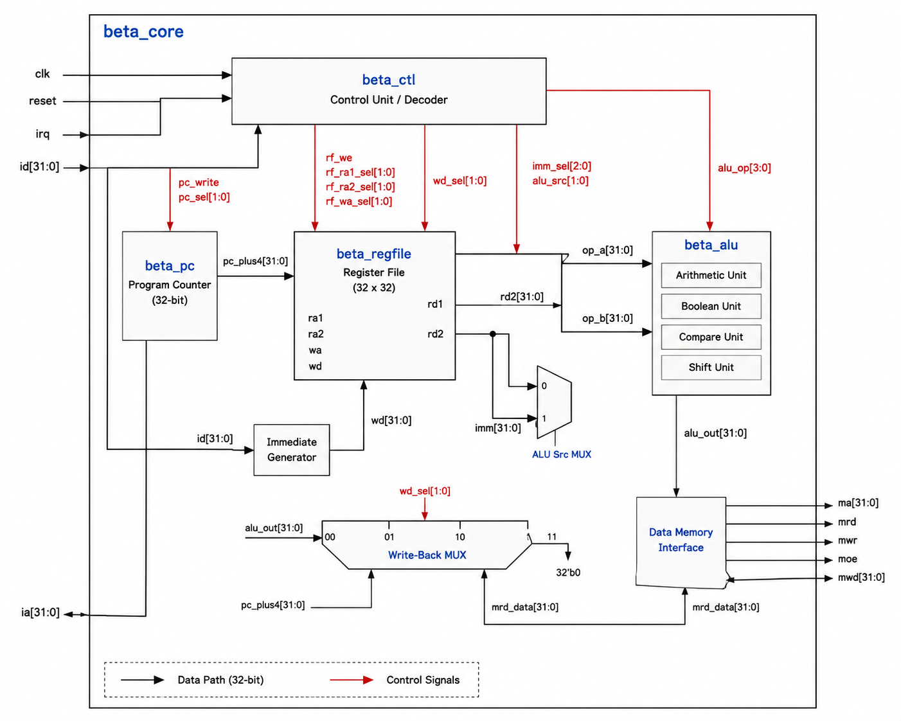
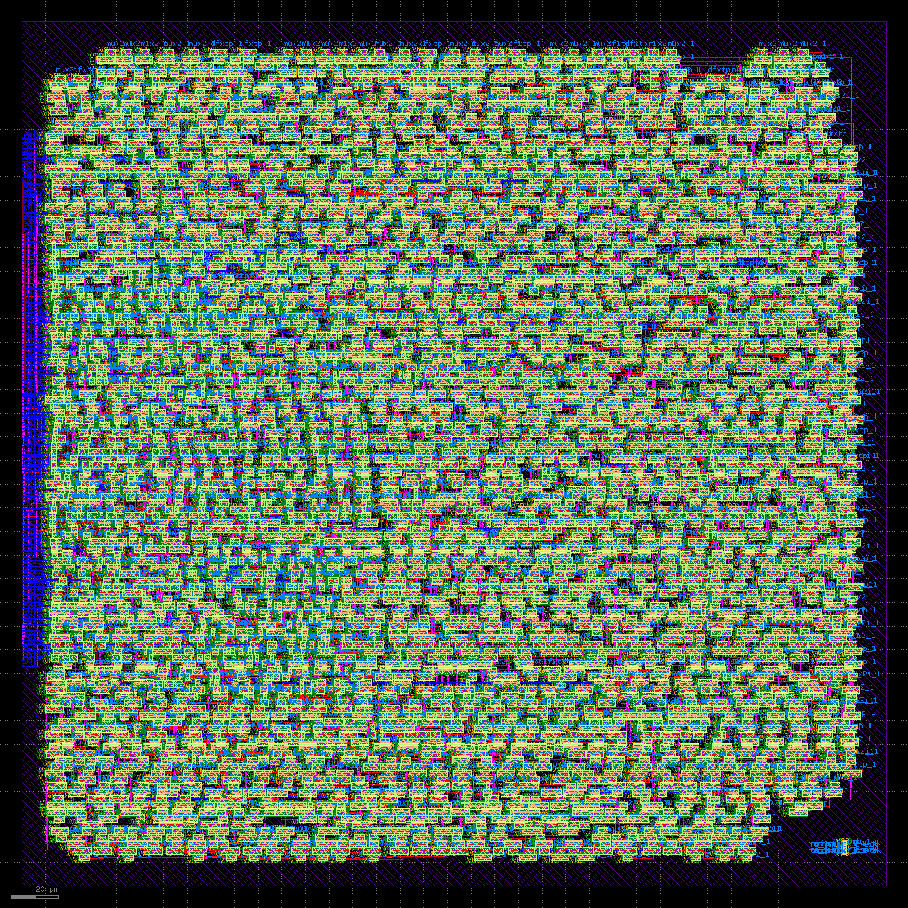
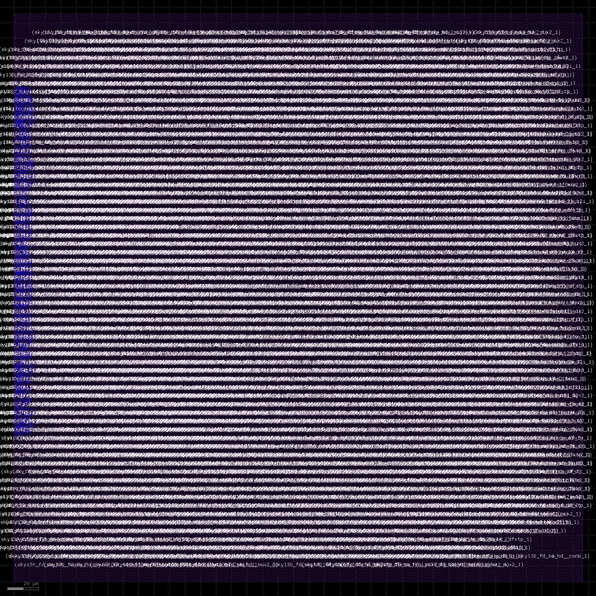

# 1. Motivation

I wanted to learn the complete ASIC design flow from RTL to GDSII. Most online projects either skip the physical design part or are too complex to understand what's actually happening at each stage.

I needed a processor design that was simple enough to fit in an academic PDK but real enough that synthesis and place-and-route wouldn't be trivial. The Beta ISA from MIT 6.004 was perfect for this - it's a complete 32-bit architecture but small enough that you can actually trace through what each module is doing.

My background is more software and FPGA work. I had done some Verilog before but never taken a design all the way to GDSII. There are a lot of tools involved (Yosys, OpenROAD, KLayout) and the documentation assumes you already know what you're doing, so I wanted to document the whole process as I figured it out.

This project is basically me learning by doing. If someone else finds it useful for learning the flow, that's great.

# 2. Introduction

This project is a 32-bit single-cycle processor implementing the Beta instruction set architecture. The design is written in behavioral Verilog, synthesized with Yosys, placed and routed with OpenROAD, and exported as GDSII on the SKY130 open-source PDK.

Beta processor features:
1. 32-bit datapath with 32 general-purpose registers
2. Single-cycle execution (no pipeline)
3. ALU with arithmetic, boolean, shift, and compare units
4. Interrupt support (basic, supervisor bit gating)
5. Synthesized to SKY130 standard cells
6. Routed layout with 0 DRC violations
7. Timing closure at 33 MHz

Directory structure:

**rtl/core/** — All Verilog source files for the processor modules

**tb/** — Testbench files for simulation

**synthesis/** — Yosys synthesis scripts and outputs

**physical/** — OpenROAD physical design scripts, intermediate files, and reports

**deliverables/** — Final GDSII, DEF, and post-route netlist

**docs/** — Architecture diagrams and layout images

Beta CPU architecture:



The processor has five main blocks: control unit (instruction decode), program counter logic, register file, ALU, and writeback mux. Memory interface is external - just address/data/control signals, no bus protocol.

# 3. Implementation Results

The processor was successfully synthesized and routed on SKY130A. Final layout is DRC clean and meets timing at 33 MHz clock.



Post-route results:

| Metric | Value |
|--------|-------|
| Technology | SKY130A, sky130_fd_sc_hd (tt_025C_1v80 corner) |
| Clock Period | 30.00 ns (33.3 MHz) |
| Worst Negative Slack | 0.00 ns |
| Total Negative Slack | 0.00 ns |
| DRC Violations | 0 |
| Die Area | 365.67 × 365.67 µm |
| Core Utilization | 50.5% (118,396 µm²) |
| Standard Cells | 4,870 |
| Nets | 4,831 |
| Total Wirelength | 218,922 µm |
| Vias | 42,151 |
| Clock Buffers | 145 (TritonCTS, max depth 7) |

Timing note: Originally tried to close timing at 10 ns (100 MHz) but hit WNS -10.34 ns. The critical path was the ripple-carry adder in the ALU - about 30 majority gates in series just for the carry chain, roughly 12 ns of the 22.6 ns path. Instead of redesigning the adder mid-project, I relaxed the clock constraint to 30 ns and re-ran the flow. Timing closed with about 9.7 ns positive slack. A carry-lookahead adder would fix this but I wanted to finish the flow first.

Detailed routing took 8 iterations to reach 0 violations:

```
Initial: 4397 violations
Iter 1:  2045
Iter 2:  2007
Iter 3:  319
Iter 4:  47
Iter 5:  21
Iter 6:  17
Iter 7:  12
Iter 8:  0
```

# 4. How to Use

## 4.1 Prerequisites

You need the following tools installed:

**For simulation:**
- Icarus Verilog (iverilog)
- GTKWave (for viewing waveforms)

**For synthesis and place-and-route:**
- Yosys (logic synthesis)
- OpenROAD (physical design)
- SKY130 PDK (via volare or manual install)
- Python 3 with KLayout Python bindings (for GDSII export)

## 4.2 Running Simulation

The testbench is a basic smoke test. It loads a few instructions and checks register/memory values after execution.

```bash
cd tb
iverilog -o sim -g2001 ../rtl/core/*.v beta_core_tb.v
vvp sim
```

Expected output: Several lines with "PASS" for each test, then "ALL TESTS PASSED" at the end.

The test covers: ADD, ADDC, SUB, SUBC, LD, ST, CMPEQ. Not a comprehensive ISA test, just enough to verify the Verilog matches the original Jade design from the MIT lab.

## 4.3 Synthesis

Synthesis script is in `synthesis/synth.ys`. It runs the standard Yosys flow and maps to SKY130 high-density standard cells.

```bash
cd synthesis
yosys synth.ys
```

Output netlist: `synthesis/outputs/beta_core_synth.v`

The flow is: proc → opt → fsm → opt → memory → opt → techmap → dfflibmap → abc → clean. Library used is `sky130_fd_sc_hd__tt_025C_1v80.lib` (typical-typical corner, 25°C, 1.8V).

## 4.4 Place and Route

Place-and-route uses OpenROAD. The script handles floorplan, placement, clock tree synthesis, and routing.

```bash
cd physical/scripts
openroad -threads 8 run_flow.tcl
```

This takes a few minutes depending on your machine. The flow:

1. Read synthesized netlist and libraries
2. Initialize floorplan (50% utilization, 1:1 aspect ratio)
3. Place pins on metal 2 and 3
4. Global placement
5. Detailed placement
6. Insert tie cells (tie-high/tie-low)
7. Clock tree synthesis (TritonCTS)
8. Global routing
9. Detailed routing
10. Write final DEF/ODB

Check `physical/reports/drc.rpt` after completion. Should be empty (0 violations).

## 4.5 GDSII Export

This OpenROAD build doesn't have a built-in GDS writer, so there's a Python script that uses KLayout's API.

```bash
cd physical/scripts
python3 def2gds.py
```

It reads the routed DEF file, merges it with the SKY130 standard cell GDS library, and writes `physical/beta_core.gds`.

Output location: `deliverables/beta_core_FINAL.gds`

# 5. Architecture Details

The Beta is a single-cycle processor - one instruction per clock, no pipeline registers. There are five main modules:

**beta_ctl (Control Unit)**

Takes the opcode field `id[31:26]` and generates all control signals for the datapath. Pure combinational logic. No state machine, no microcode ROM. Just a big case statement that maps each opcode to the set of control signals needed.

Control outputs: `asel`, `bsel`, `alufn[5:0]`, `wdsel[1:0]`, `wasel`, `werf`, `ra2sel`, `pcsel[2:0]`, `moe`, `mwr`

**beta_pc (Program Counter)**

Holds the PC and selects the next PC based on `pcsel`:
- 000: PC + 4 (sequential)
- 001: PC + 4 + offset (branch)
- 010: Jump target from register file (JMP)
- 011: Interrupt/reset vector
- 100: PC + 4 + offset (for PC-relative addressing)

On reset, PC goes to 0x80000000 (reset vector). On interrupt, PC goes to 0x80000004 (interrupt vector) if the supervisor bit `ia[31]` is clear.

**beta_regfile (Register File)**

32 registers, two read ports, one write port. Register 31 is hardwired to 0.

Has a `ra2sel` mux on the second read port that swaps between Rb and Rc. Most instructions read Ra and Rb, but store instructions (ST) need Ra and Rc instead (Rc holds the data to store, not an ALU operand).

Write happens on rising clock edge if `werf` is high. Write address comes from either `rc` field or R30 (link register), selected by `wasel`.

**beta_alu (ALU)**

Four functional units behind a 4:1 mux, selected by `ALUFN[5:4]`:

```
ALUFN[5:4] = 00 → compare unit
             01 → arithmetic unit (add/sub)
             10 → boolean unit (AND/OR/XOR/etc)
             11 → shift unit (SHL/SHR/SRA)
```

Sub-unit selection:
- **Arithmetic** (`beta_alu_arith`): `ALUFN[0]` picks add or subtract
- **Boolean** (`beta_alu_bool`): `ALUFN[3:0]` is a 4-bit truth table, indexed by `{A[i], B[i]}`
- **Shift** (`beta_alu_shift`): `ALUFN[1:0]` picks left, right logical, or right arithmetic
- **Compare** (`beta_alu_cmp`): `ALUFN[2:1]` picks equal, less-than, or less-than-or-equal

The arithmetic unit runs every cycle regardless of which function you're using. This lets the compare unit reuse its V/N/Z flags instead of doing a redundant subtraction.

**Writeback Mux**

`wdsel` picks what gets written back to the register file:
- 00: PC + 4 (for branch-and-link)
- 01: ALU result
- 10: Memory read data (LD)

**Memory Interface**

External, not part of the core. Ports are:
- `ia[31:0]` — instruction address (output)
- `id[31:0]` — instruction data (input)
- `ma[31:0]` — memory address for loads/stores (output)
- `mrd[31:0]` — memory read data (input)
- `mwd[31:0]` — memory write data (output)
- `mwr` — memory write enable (output)
- `moe` — memory output enable (output)

No bus protocol. If you want to connect this to AXI or APB you'd need a wrapper.

# 6. Physical Design Progression

Here's what the design looks like at different stages. These are actual renders from the OpenROAD output files, not mock-ups.

**Floorplan Stage**

Die area defined, core boundary set, routing tracks created. No cells placed yet. Target utilization was 50%.


**Placement Stage**

All 4,870 standard cells placed and legalized. This is pre-CTS and pre-route. Rendered from the abstract LEF view (just cell outlines, no internal geometry yet).



**Final Routed Layout**

Post-CTS, post-detailed-route. This one's merged with the actual SKY130 standard cell GDS so you can see the real transistor layout and routing geometry. 42,151 vias, 0 DRC violations.


# 7. Known Limitations

**No LVS**

Haven't run layout-versus-schematic verification. The container this was built in doesn't have KLayout CLI or Netgen installed (only Python bindings for GDSII export). What I did verify: 0 DRC violations after routing, and clean timing closure with OpenSTA. That means the extracted timing graph is consistent, but it's not the same as a real transistor-level netlist comparison against the synthesized netlist. Running full LVS is next if I get access to the proper tools.

**Ripple-carry adder**

The adder in `beta_alu_arith.v` is just a plain `+` operator, which synthesizes to a ripple-carry chain. Works fine, but it's slow - that's the critical path bottleneck described earlier. A carry-lookahead or carry-select adder would cut the delay roughly in half and let the clock come back down toward the original 10 ns target. Didn't want to redesign the ALU mid-project so I just relaxed the clock constraint instead.

**Register file uses flip-flops**

Not an SRAM macro. Each register is implemented as 32 D flip-flops. This is fine for 32 registers but wouldn't scale to anything bigger. If you needed 128 or 256 registers you'd want an SRAM compiler.

**No bus interface**

Memory ports are just raw wires - address, data, write enable, output enable. No AXI, no APB, no Wishbone. If you want to connect real peripherals you'd need to write a bus wrapper.

**Power not characterized**

OpenSTA's `report_power` needs a switching activity file (VCD or SAIF). Current testbench doesn't generate realistic activity, so power numbers would be made up. Leaving this blank rather than putting fake numbers.

# 8. Tools Used

| Tool | Purpose | Version |
|------|---------|---------|
| Icarus Verilog | RTL simulation | 11.0+ |
| GTKWave | Waveform viewer | - |
| Yosys | Logic synthesis | Latest |
| OpenROAD | Physical design (floorplan, P&R, CTS) | 26Q3-876-gd5bdae6021 |
| OpenSTA | Static timing analysis | (included in OpenROAD) |
| KLayout | GDSII export and visualization | Python bindings |
| SKY130 PDK | Standard cell library | SKY130A via volare |

# 9. Future Work

1. Run LVS with proper tools (KLayout CLI or Netgen)
2. Replace ripple-carry adder with carry-lookahead or carry-select
3. Add switching activity to testbench and characterize power
4. Try tighter utilization (70-80%) and see if it still routes cleanly
5. Add APB or AXI bus wrapper for memory interface
6. Try different clock frequencies and corner PVT conditions

# 10. References

- MIT 6.004 course materials (Beta ISA specification)
- Beta architecture lab from `Beta_cpu.json` (Jade simulator design)
- SKY130 PDK documentation: [https://skywater-pdk.readthedocs.io/](https://skywater-pdk.readthedocs.io/)
- OpenROAD documentation: [https://openroad.readthedocs.io/](https://openroad.readthedocs.io/)
- Yosys manual: [https://yosyshq.net/yosys/](https://yosyshq.net/yosys/)

---

**Project Status:** Functional processor with clean DRC and timing closure at 33 MHz. Known limitations documented above. All source files and scripts included in this repo.
